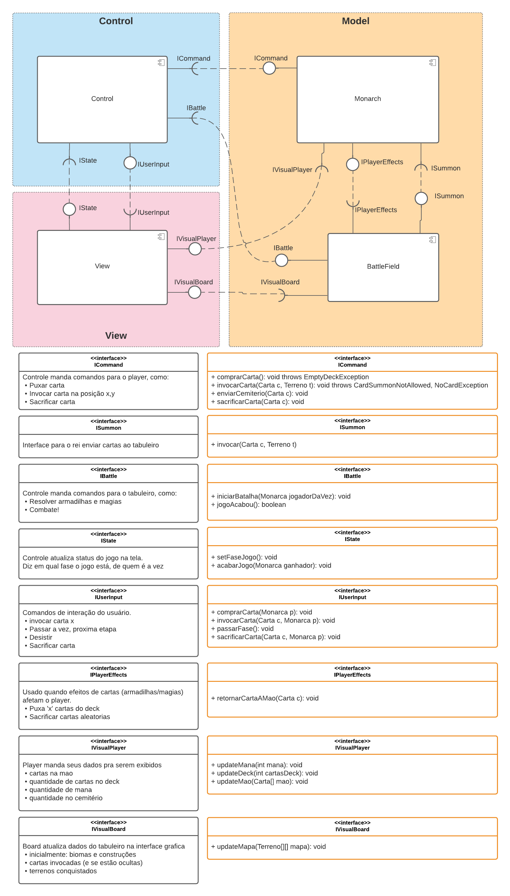
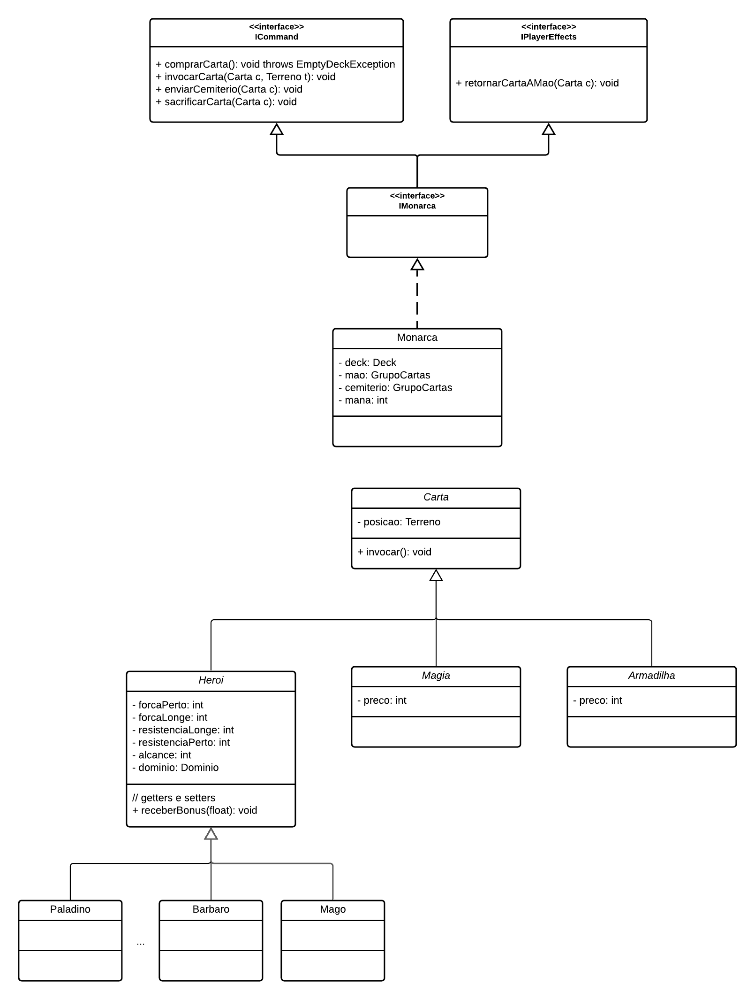

# Projeto `Trilha da Glória`

# Descrição

Trilha da Glória é um jogo épico de cartas e conquista de terrítórios de 2 players. O objetivo é conquistar terrenos conectando o seu reino ao reino do inimigo. Posicione suas tropas, armadilhas e magias para vencer o oponente. Use estratégicamente suas tropas: cada tipo de herói possui uma habilidade especial e um domínio que dão vantagens em certos tipos de terrenos ou em terrenos que possuam construções.
Leia o [manual](Regras/Manual.md) para mais informações sobre as regras do jogo.

# Equipe POONinjas
* João Victor Evangelista Matoso - 176293
* Luiz Felipe Cezar - 183146

# Vídeos do Projeto

## Vídeo da Prévia
* Neste [video](assets/apresentacao-video.mp4), é apresentado a proposta do jogo, as regras e mecânicas básicas e um primeiro modelo simples da arquitetura do jogo.

# Slides do Projeto

## Slides da Prévia
* Este [slide](assets/apresentacao-slide.pdf) apresenta a proposta do jogo, suas regras e mecânicas básicas e um primeiro modelo simples da arquitetura do jogo.

# Documentação dos Componentes
# Diagramas

## Diagrama Geral do Projeto
O jogo é construído seguindo a arquitetura Model-View-Control. O controle é responsável pelo fluxo e consistência do jogo. O view faz a exibição do jogo na tela, assim como captura as ações do usuário. Já o modelo é composto por dois principais componentes: o Monarch representa um player e suas tropas (cartas); e o BattleField que representa o tabuleiro com os terrenos e construções e é responsável por modelizar os combates entre as cartas invocadas.

Na figura abaixo, estes componentes estão detalhados juntos com as interfaces de comunicação.

## Diagrama Geral de Componentes
Logo abaixo, está um modelo mais aprofundado do componente Monarch, responsável por modelizar o player e suas cartas.

