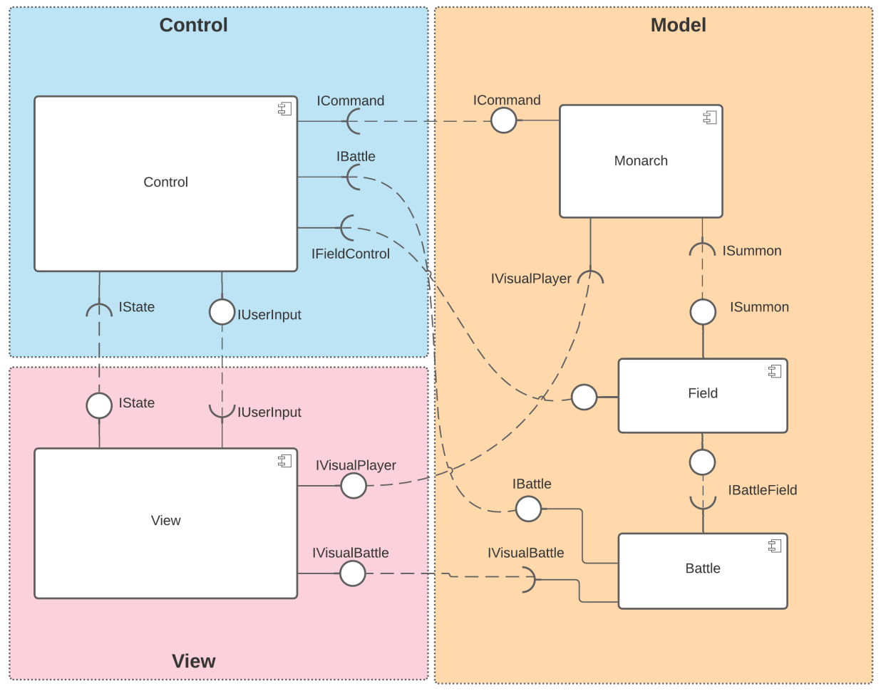
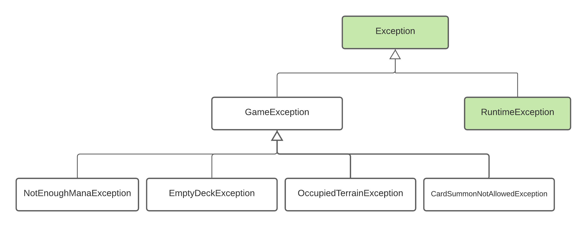

# Projeto Trilha da Glória

# Descrição Resumida do Projeto/Jogo

Trilha da Glória é um jogo épico de cartas e conquista de terrítórios de dois players. O objetivo é conquistar terrenos conectando o seu reino ao reino do inimigo. Posicione suas tropas e armadilhas para vencer o oponente. Use estratégicamente suas tropas: cada tipo de herói possui uma habilidade especial e um domínio que dão vantagens em certos tipos de terrenos.

Leia o [manual](Regras/Manual.md) para mais informações sobre as regras do jogo.

# Equipe POONinjas
* João Victor Evangelista Matoso - 176293
* Luiz Felipe Cezar - 183146

# Vídeos do Projeto

## Vídeo da Prévia
* Neste [video](assets/apresentacao-video.mp4), é apresentado a proposta do jogo, as regras e mecânicas básicas e um primeiro modelo simples da arquitetura do jogo.

## Vídeo do Jogo
* Neste [video](assets/apresentacao-final.mp4), é apresentado brevement o funcionamento do jogo.

# Slides do Projeto

## Slides da Prévia
* Este [slide](assets/apresentacao-slide.pdf) apresenta a proposta do jogo, suas regras e mecânicas básicas e um primeiro modelo simples da arquitetura do jogo.

## Slides da Apresentação Final

## Relatório de Evolução
Foram enfrentadas algumas dificuldades durante o desenvolvimento do projeto, pricipalmente na fase de design da arquitetura do jogo. Como ambos os membros tinham pouca experiência no início do projeto, foi imaginada uma arquitetura buscando atender os requisitos e a flexibilidade que o jogo propoẽ, e logo vimos que ela seria insuficiente.

Na tentativa de ajustes na arquitetura durante a fase de desenvolvimento, algumas regras da arquitetura de componentes foram quebradas. A estrutura global respeita a arquitetura Model-View-Control, porém internamente (principalmente no modelo), componentes que eram pra ser modulares acabaram tendo uma ligação forte.

Outra dificuldade enfrentada foi de lidar com conceitos novos de redes e comunicação entre máquinas, afim de desenvolver um jogo multiplayer online. Em geral, a equipe evoluiu seus conhecimentos em varias areas da computação, desde o início deste projeto.

# Destaques de Código

## Servidor
Como dito anteriormente, a equipe adquiriu muito conhecimento prático na área de redes durante o desenvolvimento desse projeto. Nesse projeto, o servidor tem o papel de gerar as cartas e o tabuleiro, e sincronizar as ações entre os dois players. Logo abaixo, está destacado a parte do código do servidor que implementa a *thread* de comunicação com o cliente

~~~java
// Thread de escuta de mensagens do cliente
public void run() {
  try {
    while(true) {
      // Aguarda comunicação do cliente
      Mensagem pkt = (Mensagem) dataIn.readObject();
      System.out.println("Player #" + playerId + ": " + pkt.command);

      // Verifica se jogo acabou
      if(pkt.command.equals("gameover")) {
        break;
      } else {
        // Encaminha pacote para o oponente
        enemy.enviarPacote(pkt);
      }
    }
  } catch(...) {
    ...
  }

  // Fim da thread. Fecha conexão com o cliente
  closeConnection();
}
~~~

## Máquina de estados
Para realizar o controle do fluxo de jogo, assim como a sincronização entre os players, foi implementado uma máquina de estados utilizando um `enum` dentro da classe `Controle`. Logo abaixo é mostrado um trecho de código desta máquina:

~~~java
// Função chamada quando usuário pressiona o botão para passar de fase
public void passarFase() {
  stm = stm.proximoEstado();

  // Sincroniza ações com o player remoto
  if(suaVez) {
    Mensagem msg = new Mensagem();
    msg.command = "passar";
    remote.enviarMensagem(msg);
  }

  switch(stm) {
  case RevelarArmadilhas:
    battle.ativarHabilidadesPassivas();
    battle.revelarArmadilhas();
    break;
  case AtivarArmadilhas:
    battle.ativarArmadilhas();
    break;
  case RevelarCombate:
    battle.gerarBatalhas((suaVez) ? playerId : inimigoId);
    break;
  case Combate:
    battle.iniciarBatalhas();
    break;
  case AguardandoCompra:
    fimDeTurno();
    suaVez = !suaVez;
    break;
  }
}
~~~

## Efeitos
O ponto mais importante do jogo Trilha da Glória é a sua flexibilidade em relação as habilidades do Heróis. Para modelar os efeitos que heróis, armadilhas (e futuramente magias) podem gerar durante o jogo, foi criado a Classe `Efeito` que descreve o bonus e a duração de um efeito sob um Heroi. Logo abaixo é mostrado o trecho de código da habilidade passiva do `Paladino`. Ele gera +10% de bonus para aliados adjacente a ele. Além disso, o efeito é eliminado quando a carta é destruída.

~~~java
public class Paladino extends Heroi {
ArrayList<Heroi> aliadosSobEfeito;
ArrayList<Efeito> efeitosGerados;
...
public void passiva() {
// Percorre terrenos vizinhos
  for(Terreno vizinho : this.terreno.getVizinhos()) {
    Carta c = vizinho.getCarta(dono.getPlayerId());

    if(c != null && c instanceof Heroi) {
      Heroi h = (Heroi) c;

      if(!aliadosSobEfeito.contains(h)) {
        aliadosSobEfeito.add(h);

        Efeito ef = new Efeito(0.1f, 0.1f, null);
        ef.aplicarEfeito(h);

        efeitosGerados.add(ef);
      }
    }
  }
}
~~~

# Conclusões e Trabalhos Futuros

Concluímos com esse projeto que o desenvolvimento de um grande jogo, com muitas regras e exceções, exige um planejamento muito preciso e visão a longo prazo aguçada. Projetos grandes precisam ser bem estruturados para facilitar o trabalho colaborativo, implementação de novos recursos e depuração de erros.

Gostariamos de ter tido mais tempo para a realização desse projeto. Existem algumas melhorias que podem ser feitas a nível de design, como a criação de um componente para as cartas, e também a implementação de magias e novas habilidades para os heróis.

Para que habilidades e efeitos criativos possam ser implementados, o código precisa ser flexível e bem estruturado, e acreditamos que ainda há muito espaço para isto. Apesar da disciplina ter chegado ao fim, continuaremos o desenvolvimento e a implementação das funções inicialmente planejadas e de novas habilidades!

# Documentação dos Componentes

## Diagrama Geral do Projeto
O jogo é construído seguindo a arquitetura Model-View-Control. O controle é responsável pelo fluxo, sincronização entre os players e consistência do jogo. O view faz a exibição do jogo na tela, assim como captura as ações do usuário. Já o modelo é composto por três principais componentes: o `Monarch` representa um player e suas tropas (`Cartas`); e o `Field` que representa o tabuleiro com os terrenos, e o `Battle` que é responsável por modelizar os combates entre as cartas invocadas e resolver os efeitos.

## Diagrama Geral de Componentes
Logo abaixo, está um modelo geral de componentes do sistema.

## Componente `Control`

Este componente é responsável por controlar o fluxo e ações do jogo, como decidir em qual momento ativar armadilhas ou resolver combates. Além disso, ele realiza a sincronização com o jogador que está remotamente.

**Ficha Técnica**
item | detalhamento
----- | -----
Classe | `mc322.trilhadagloria.control.Controle`
Autores | João Victor Matoso   Luiz Felipe Cezar
Interfaces | `IUserInput` 

### Interfaces

Interface agregadora do componente em Java:

~~~java
public interface IControle extends IRBattle, IRCommand, IUserInput, IRViewControl, IRFieldControl, IRRemoteEnemy {
}
~~~

## Detalhamento das Interfaces

### Interface `IUserInput`

Utilizada pela interface para entrada de comandos do jogador local.

~~~
public interface IUserInput {
	public void comprarCarta();
	public void invocarCarta(Carta c, Terreno t);
	public void passarFase();
	public void sacrificarCarta(Carta c);
}
~~~

## Componente `Monarch`

Este componente é responsável por modelar o jogador e suas cartas.

**Ficha Técnica**
item | detalhamento
----- | -----
Classe | `mc322.trilhadagloria.monarch.Monarca`
Autores | João Victor Matoso   Luiz Felipe Cezar
Interfaces | `ICommand` 

### Interfaces

Interface agregadora do componente em Java:

~~~java
public interface IMonarca extends ICommand, IRSummon {
}
~~~

## Detalhamento das Interfaces

### Interface `ICommand`

Utilizada pelo `Controle` para entrada de comandos do jogador.

~~~
public interface ICommand {
	public void comprarCarta() throws EmptyDeckException;
	public void enviarCemiterio(Carta c);
	public void invocarCarta(Carta c, Terreno t) throws NotEnoughManaException, GameExceptions;
	public void sacrificarCarta(Carta c);
	public void sacrificarCarta(int cartaId);
	public void invocarCarta(int cartaId, int[] posTabuleiro) throws NotEnoughManaException, GameExceptions;
}
~~~

## Componente `Battle`

Este componente é responsável por modelar as batalhas do jogo.

**Ficha Técnica**
item | detalhamento
----- | -----
Classe | `mc322.trilhadagloria.battle.GerenciadorDeBatalhas`
Autores | João Victor Matoso   Luiz Felipe Cezar
Interfaces | `IBattleControl`

### Interfaces

Interface agregadora do componente em Java:

~~~java
public interface IBattle extends IBattleControl, IRBattleField {
}
~~~

## Detalhamento das Interfaces

### Interface `IBattleControl`

Utilizada pelo `Controle` para entrada de comandos de resolução de batalhas.

~~~
public interface IBattleControl {
	public void revelarArmadilhas();
	public void ativarArmadilhas();
	public void gerarBatalhas(int atacanteId);
	public void iniciarBatalhas();
	public void ativarHabilidadesPassivas();
}
~~~

## Componente `Field`

Este componente é responsável por modelar o tabuleiro do jogo.

**Ficha Técnica**
item | detalhamento
----- | -----
Classe | `mc322.trilhadagloria.field.Tabuleiro`
Autores | João Victor Matoso   Luiz Felipe Cezar
Interfaces | `IBattleField`   `IFieldControl`   `ISummon`

### Interfaces

Interface agregadora do componente em Java:

~~~java
public interface IField extends ISummon, IBattleField, IFieldControl, IRTabConnect {
}
~~~

## Detalhamento das Interfaces

### Interface `IBattleField`

Utilizada pelo `Battle` para obtenção das cartas invocadas e remoção de cartas após o combate.
~~~
public interface IBattleField {
	public ArrayList<Armadilha> getArmadilhasInvocadas();
	public ArrayList<Heroi> getHeroisInvocados();
	public void remover(Carta carta);
}
~~~

### Interface `ISummon`

Utilizada pelo `Monarch` para invocar cartas no tabuleiro.
~~~
public interface ISummon {
	public void invocarCarta(Carta c, Terreno t, int playerId) throws GameExceptions;
	public Terreno getTerreno(int i, int j);
}
~~~

### Interface `IFieldControl`

Utilizada pelo `Controle` para controle de turnos e verificar condições de vitória e fim de jogo.
~~~
public interface IFieldControl {
	public void incrementarTurnoCartasInvocadas();
	public boolean verificarCaminhoFechado(int playerId);
}
~~~

## Componente `View`

Este componente é responsável pela interface gráfica do jogo.

**Ficha Técnica**
item | detalhamento
----- | -----
Classe | `mc322.trilhadagloria.gui.telaPrinc.TelaPrincipal.java`   `mc322.trilhadagloria.gui.telaPrinc.TabView.java`   `mc322.trilhadagloria.gui.telaPrinc.BatalhaView.java` 
Autores | João Victor Matoso   Luiz Felipe Cezar
Interfaces | `IViewTerreno`   `ITableCartas`   `IManaView`   `ICardCount` 

## Detalhamento das Interfaces
### Interface `IViewTerreno`
Utilizada pelos `Terrenos` para atualizar o bioma e as cartas invocadas na interface gráfica.

~~~java
public interface IViewTerreno {
    public void gerarImgBio(String bio);
    public void adicionarCartaAcima(IStatusCarta carta);
    public void adicionarCartaAbaixo(IStatusCarta carta);
    public void removerCartaSuperior();
    public void removerCartaInferior();
}
~~~

### Interface `ITableCartas`

Utilizada pelo `GrupoCartas` para atualizar as cartas da mão e do cemitério na interface gráfica sempre que houver uma mudança.

~~~java
public interface ITableCartas {
	public void adicionarCarta(IStatusCarta carta);
	public void removerCarta(IStatusCarta carta);
}
~~~
### Interface `IManaView`

Utilizada pelo `Monarca` para atualizar a quantidade de mana disponível.

~~~java
public interface IManaView {
	public void atualizarMana(int qtd);
}
~~~
### Interface `ICardCount`

Utilizada pelo `Deck` para atualizar a quantidade de cartas restantes no Deck.

~~~java
public interface ICardCount {
	public void reduzirContador();
}
~~~

# Plano de Exceções

## Diagrama da hierarquia de exceções

## Descrição das classes de exceção

Classe | Descrição
----- | -----
GameException | Engloba todas as exceções de jogo não aceitas.
NotEnoughManaException | Indica que a impossibilidade de invocar uma carta devido a falta de *mana*.
EmptyDeckException | Indica a tentativa de comprar uma carta sem cartas disponiveis.
OccupiedTerrainException | Indica a impossibilidade de invocar uma carta em um terreno pois já existe uma outra carta ali invocada.
CardSummonNotAllowedException | Indica a impossibilidade de invocar uma carta

