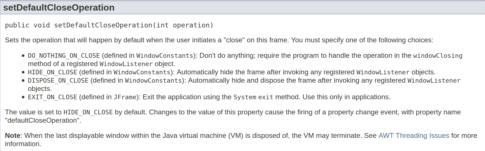
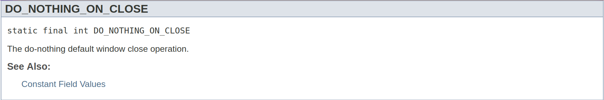
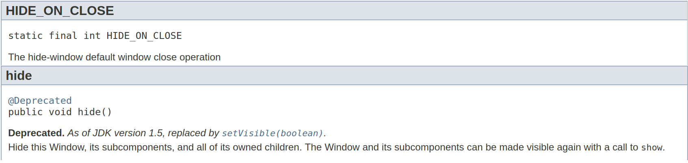
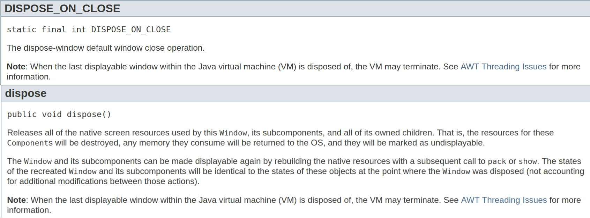
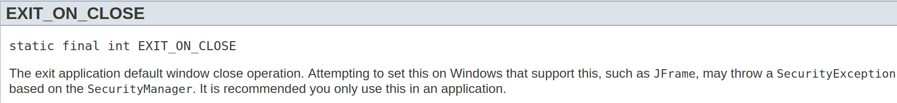

# Informações sobre interfaces gráficas

## [Close Operations](https://docs.oracle.com/javase/7/docs/api/javax/swing/JFrame.html#setDefaultCloseOperation(int))



* [Detalhamento um pouco maior sobre os CloseOperations](https://docs.oracle.com/javase/7/docs/api/javax/swing/WindowConstants.html#DO_NOTHING_ON_CLOSE)









## [GridBagLayout](https://docs.oracle.com/javase/tutorial/uiswing/layout/gridbag.html)

Layout Manager bom para posicionar os elementos ingame. O detalhamento é grande, então é melhor checar direto na página

Resumo:

Propriedades de GridBagConstraints
```
* fill: Determina por onde o componente ajusta suas dimensões de acordo com as células que ocupa (NONE, HORIZONTAL, 
  VERTICAL, BOTH)
* gridx, gridy: Determina o posicionamento do componente no GridBagLayout, começando do 0
  Se o componente ocupar mais de uma célula, eles determinam a posição da primeira célula que ele ocupa, ou seja, a 
  mais à esquerda e acima
* gridwidth e gridheight: Determina o número de células em linhas e em colunas que o componente vai ocupar
* weightx e weighty: Determina o peso (proporção) em que o componente vai crescer ou encolher, conforme o tamanho do 
  painel varia
  Se todos os componentes do painel tiverem seus pesos em x e em y iguais a 0 (padrão), os componentes ficam com 
  tamanho fixo.
  Para fazer com que variem dinamicamente o tamanho, devem ter pesos diferentes de 0 em pelo menos uma das direções
  Os pesos de cada componente são igualados para cima, para coincidir com o maior peso dentre os da mesma linha e os 
  da mesma coluna
* Insets: Determina o espaço mínimo entre as bordas do componente e qualquer coisa que esteja no sentido indicado 
  (acho que em pixels)
  Insets(int cima, int esquerda, int baixo, int direita)
* anchor: Determina a centralização do componente na sua área designada, se suas dimensões forem menores do que o 
  espaço que ele ocupa
```
Mais sobre [Insets](https://docs.oracle.com/javase/8/docs/api/java/awt/Insets.html) e [Anchor](https://docs.oracle.com/javase/8/docs/api/java/awt/GridBagConstraints.html#anchor)

As propriedades dos constraints do componente a ser adicionado no layout devem ser definidas em um objeto GridBagConstraints, para ser passado como parâmetro junto com o componente ao adicioná-lo ao layout. É recomendável criar um objeto constraint novo cada vez que for adicionar um componente ao layout, para evitar bugs gerados por constraints inesperados.

